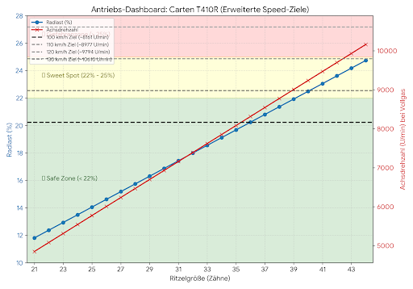

## 📊 Antriebs-Dashboard: Speed-Ziele & Thermische Zonen

Das folgende Dashboard visualisiert die physikalischen Grenzen des **Carten T410R** in Kombination mit dem spezifizierten **3660 Brushless Motor (3700KV an 3S)**. 

Es zeigt den direkten Zusammenhang zwischen der gewählten Ritzelgröße, der resultierenden mechanischen Belastung (Radlast in %) und der erreichbaren Achsdrehzahl.

### Lesehilfe für das Dashboard:
* **Die gestrichelten Linien (Graustufen):** Markieren die benötigte Achsdrehzahl für unsere Meilensteine (100, 110, 120 und 130 km/h) bei einem Reifendurchmesser von 65 mm.
* **Die rote Kurve (Achsdrehzahl):** Zeigt die theoretisch anliegende Drehzahl der Räder bei Vollgas pro Ritzel. Wo diese Kurve eine der gestrichelten Linien schneidet, wird das jeweilige Geschwindigkeitsziel erreicht.
* **Die blaue Kurve (Radlast):** Zeigt die mechanische Belastung des Motors. 
* **Die farbigen Zonen (Hintergrund):** Definieren die thermischen Toleranzgrenzen des 3660er Motors.
  * 🟢 **Safe Zone (< 22 %):** Dauerlast problemlos möglich.
  * 🟡 **Sweet Spot (22 % - 25 %):** Perfekt für Speedruns, thermisches Limit im Auge behalten.
  * 🔴 **Gefahrenzone (> 25 %):** Akute Überhitzungsgefahr, nur für extreme Kurz-Sprints.

**Fazit der Visualisierung:** Das primäre Projektziel von **100 km/h** wird ab einem **35Z/36Z Ritzel** erreicht. Die Radlast befindet sich an diesem Punkt noch absolut sicher in der tiefgrünen Zone. Das Setup bietet mechanische Reserven bis ca. 125 km/h.

## 📐 Die "Radlast %" Formel erklärt

Die in unseren Skripten berechnete **Radlast in Prozent** ist ein empirischer Indikator für die mechanische Belastung des Motors. Sie basiert auf dem Kehrwert der Gesamtübersetzung (Final Drive Ratio, kurz FDR). 

Je kleiner die FDR (also je "länger" das Getriebe übersetzt ist), desto weniger Hebelwirkung hat der Motor. Er muss folglich mehr rohe Kraft aufwenden, um das Auto gegen den exponentiell steigenden Luftwiderstand anzuschieben.

### Die Berechnung
1. **Gesamtübersetzung (FDR) berechnen:**
   FDR = (Hauptzahnrad / Motorritzel) * Interne Übersetzung
   *(Beim Carten T410R beträgt die interne Übersetzung 2.47)*

2. **Radlast-Faktor berechnen:**
   Radlast (%) = (1 / FDR) * 100

**Beispiel:** Bei einem 72Z Hauptzahnrad und einem 36Z Ritzel ergibt sich eine FDR von `(72 / 36) * 2.47 = 4.94`.
Die Radlast beträgt somit `(1 / 4.94) * 100 = 20.2 %`.

### Die Belastungs-Zonen (für 3650er Motoren / 4000kV an 3S)
Diese Zonen haben sich in der Praxis als verlässliche Richtwerte für die Temperatur- und Stromüberwachung etabliert:

* **< 19.0 % (Grüne Zone):** Hohe Hebelwirkung. Perfekt für verwinkelte Strecken, Stop-and-Go und langes Bashing. Elektronik bleibt kühl.
* **19.0 % - 22.0 % (Gelber Sweet Spot):** Ideale Balance für Speedruns. Das Auto erreicht Topspeed, Elektronik wird sehr warm, benötigt nach 1-2 Runs Abkühlung.
* **22.0 % - 25.0 % (Rote Gefahrenzone):** Extreme Belastung. Ausschließlich für kurze, lineare Beschleunigungsrennen mit aktiver Lüfterkühlung geeignet.
* **> 25.0 % (Hitzetod):** Die Hebelwirkung reicht nicht mehr aus. Der Motor zieht Blockierströme, wandelt Energie fast nur noch in Hitze um und riskiert die sofortige Zerstörung von ESC oder Rotor.
