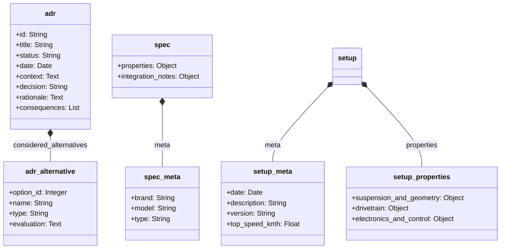

# 1:10 onroad RC car for speeds over 100 km/h

This project covers the system architecture and configuration of an 1:10 scale on-road touring car with the design goal of a consistently repeatable top speed of over 100 km/h. The focus is on maximizing drive power while ensuring reliability and cost efficiency.

The technical challenge primarily results from the chosen scale and the limited tire diameter of 64 millimeters. While vehicles from 1:8 scale have physical advantages due to higher mass inertia, larger rolling circumferences, and a longer wheelbase, the 1:10 scale requires significantly higher rotor speeds. This leads to high mechanical stresses in the drivetrain. The low vehicle weight also requires precise aerodynamic and suspension tuning to ensure driving stability at high speeds.

<table>
  <tr>
    <td></td>
    <td></td>
  </tr>
</table>

## Table of contents
* [Repository structure](#repository-structure)
* [Artefacts (ADR, specs, setup sheets)](#artefacts-adr-specs-setup-sheets)
* [Calculation models for drivetrain design](#calculation-models-for-drivetrain-design)
* [Learnings & modifications](#learnings--modifications)
* [Repository automation](#repository-automation)
* [Follow-up project: Telemetry system](#follow-up-project-telemetry-system)
* [Licensing](#licensing)

## Repository structure
The project is structured into topic-specific directories:
* **`/architecture`**: Documentation of basic system designs and architecture decisions.
* **`/electronics`**: Selection and specification of electronic components such as motors, electronic speed controllers, and batteries.
* **`/photos`**: Central directory for all image files and visual documentation of the project.
* **`/mechanics`**: Chassis design, construction data, and specification of physical components.
  * **`/carten_t410r`**: Vehicle-specific data and instructions.
  * **`/geometry`**: Suspension settings.
  * **`/body`**: Body specifications.
  * **`/paint`**: Color and painting data.
  * **`/wheels`**: Tire specifications.
* **`/testing`**: Collection and evaluation of test results and performance measurement data.
  * **`/error_list`**: Error logs and their resolutions.
  * **`/tests`**: Logs and data of test drives.
* **`/project`**: General project management and overviews for cost control.
  * **`/costs`**: Cost tracking and budget overviews.
  * **`/follow_up_projects`**: Documentation of related follow-up projects.
* **`/scripts`**: Automation scripts and calculation models for system design.
* **`/set_up_sheets`**: Vehicle setup configurations.

## Artefacts (ADR, specs, setup sheets)
The documentation of architecture decisions (ADRs), the specifications of all mechanical and electronic components, and the vehicle setup configurations are consistently maintained as structured YAML files (`.yml` or `.yaml`). The formal hierarchical structure of these artefacts is standardized as follows:

## Calculation models for drivetrain design
To avoid thermal or mechanical overload of the electronic components, custom-developed calculation models are used:
* **Gearing calculator (`scripts/calc/getriebe_calc.py`)**: Simulates the mechanical wheel load for the motor based on tire diameter and target speed, depending on available motor pinions. Setups are categorized into load zones for the defined drive system.
* **Limit calculator (`scripts/calc/max_speed.py`)**: Calculates the achievable top speed considering specific motor data, battery voltage, and defined thermal tolerance limits based on physical hardware specifications.

## Learnings & modifications (so far...)
This section documents the findings from previous tests & speedruns in 1:10 scale as well as the resulting modifications to the vehicle.

| Driving operation & environment |
|:---|
| **[L] Track selection** A suitable track is crucial for success. Clean asphalt is absolutely necessary. The track should preferably not be bordered by walls or curbs. A minimum width of 8 meters is required. |
| **[L] Weather** The weather is also important. Ensure there is no wind and conditions are dry. |
| **[L] Safety** If the conditions are not right and you don't have a good feeling, no speedrun should be undertaken. |
| **[L] Driving practice** You must learn to drive. It is necessary to familiarize yourself with the vehicle and the acceleration curve. It is important to steer the vehicle smoothly when it is far away. |

| Suspension & geometry |
|:---|
| **[M] Dampers & springs** Very viscous shock oil was used and spring preload maximized. Stiff suspension is absolutely necessary to prevent loss of control due to diving. |
| **[M] Suspension geometry** Rear toe-in of 2.5 degrees and 0 degrees camber. Front 0 degrees toe-in and 0 degrees camber. No experiments should be made here. |
| **[M] Sway bars** The sway bars were removed. They are unnecessary for speedruns and pose a potential source of error. |
| **[M] Droop screws** The droop screws were removed. Since the track is not manually cleaned, further lowering is not constructive. The screws are unnecessary for the regular 1:10 speedrun. |
| **[L] Weight distribution** Care must be taken to ensure an even left/right weight distribution. Furthermore, the front must not be too light. |

| Drivetrain |
|:---|
| **[L] Motorization** Sufficient motorization is less of a problem than often assumed. You shouldn't invest too much here. |
| **[M] Motor & gearing** Use of a 3660 motor with a tall gear ratio instead of the usual 3650 motor. The motorization must be adapted to the available track. |
| **[M] Differential (front)** A front spool was installed. During straight-line running at maximum speed, diff-out must be absolutely avoided; speed compensation is not desired. |
| **[L] Differential (rear)** Making the rear differential stiffer is not necessary. The front spool is sufficient. |
| **[L] Thermal management** Problems with ESC and motor temperature have not occurred yet. The problem is apparently overrated. |

| Electronics & control |
|:---|
| **[L] Control components** **Do not skimp on the remote control and servo**. Lack of precision makes steering corrections a game of chance. You must invest in a remote control with hall sensors and a decent digital servo. |
| **[L] Assistance systems** **Using a Gyro really makes a difference** and is highly recommended. |
| **[L] Steering mechanics** The steering mechanism must move without resistance when disconnected from the servo. Mechanical resistance prevents the servo from returning precisely to the neutral position during slow steering inputs. In this state, the servo stops visibly but continues to draw current, indicated by audible noise, as it attempts to reach the neutral position. |
| **[L] `Steering Exponential Curve` (cubic polynomial)** The steering exponential curve requires precise configuration. A setting of approximately -30 is recommended. |
| **[L] `Throttle Exponential Curve` (cubic polynomial)** The throttle exponential curve requires precise configuration. A setting of approximately -40 is recommended. |

| Chassis & assembly |
|:---|
| **[L] Material selection** Not all plastic parts should be replaced with aluminum. You must consider which parts are allowed to be destroyed in a crash. If easily replaceable plastic parts are replaced with aluminum, the impact energy finds more unfavorable paths. |
| **[L] Threadlocker** Loctite on metal connections is absolutely mandatory. |
| **[L] Body** The body should not be painted. A clear body allows a necessary view of the technology at all times. |
| **[L] Aerodynamics** A wedge shape of the vehicle is necessary for efficient aerodynamics. To achieve this, the front body posts must be shortened as much as possible. |
| **[M] C-hub assembly** The mounting screws of the C-hubs were loosened to eliminate mechanical resistance. Excessive tightening prevents the steering from moving freely, resulting in the previously described issue of an inaccurate servo neutral return. |
| **[M] Servo saver** The servo saver was removed and an aluminum servo horn was mounted directly. This increases the risk of damage to the servo in the event of a crash. The servo saver was identified as a source of failure (steering oscillation) during speedruns. |

*(Legend: **[L]** = learning, **[M]** = modification)*

## Repository automation
Maintaining the specifications and architecture decisions formatted as YAML files triggers automated processes:
* **Aggregation of specifications**: Individual hardware specifications are merged into a central specification file in the root directory.
* **Cost overview**: Bill of materials and shopping lists are automatically derived from the specifications and updated.
* **Decision log**: Architecture decisions are automatically compiled into a chronological log.

## Follow-up project: Telemetry system
This project is followed by an independent project concerned with the development of a telemetry data system based on an ESP32 microcontroller. The goal is the sensory recording and transmission of driving dynamics parameters of the RC vehicle.

## Licensing
* The source code of the calculation models is subject to the MIT license.
* The hardware design, documentation, specifications, and test results are released under the Creative Commons attribution 4.0 international license. Own adaptations and commercial use are permitted, provided authorship is acknowledged.
