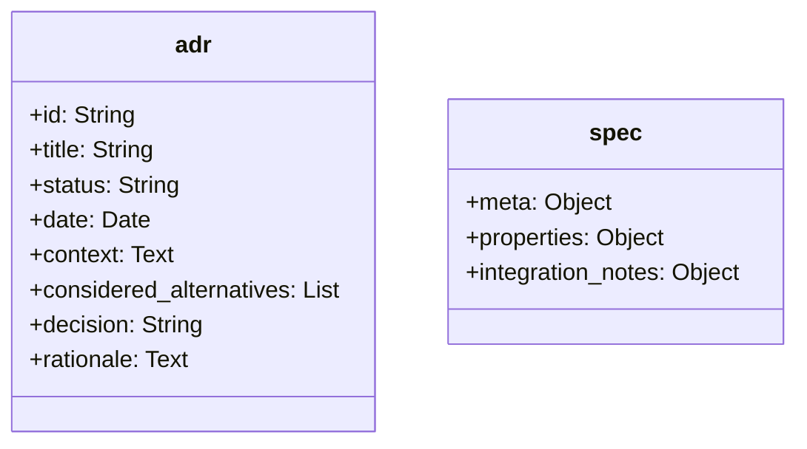

# RC100: 1:10 RC-Fahrzeug für Geschwindigkeiten über 100 km/h

Dieses Projekt umfasst die Systemarchitektur und den Aufbau eines Onroad-Tourenwagens im Maßstab 1:10 mit dem Konstruktionsziel einer jederzeit wiederholbaren Endgeschwindigkeit von über 100 km/h. Der Fokus liegt auf der Maximierung der Antriebsleistung bei gleichzeitiger Gewährleistung der Zuverlässigkeit und Kosteneffizienz.

Die technische Herausforderung resultiert primär aus dem gewählten Maßstab und dem limitierten Reifendurchmesser von 64 Millimetern. Während Fahrzeuge ab dem Maßstab 1:8 durch höhere Masseträgheit, größere Abrollumfänge und einen längeren Radstand physikalische Vorteile aufweisen, erfordert der Maßstab 1:10 signifikant höhere Rotordrehzahlen. Dies führt zu hohen mechanischen Belastungen im Antriebsstrang. Das geringe Fahrzeuggewicht erfordert zudem präzise aerodynamische und fahrwerksseitige Abstimmungen zur Sicherstellung der Fahrstabilität bei hohen Geschwindigkeiten.

<table>
  <tr>
    <td></td>
    <td></td>
  </tr>
</table>

## Inhaltsverzeichnis
* [Repository-Struktur](#repository-struktur)
* [Hardwarearchitektur und Mechanik](#hardwarearchitektur-und-mechanik)
* [Berechnungsmodelle zur Antriebsauslegung](#berechnungsmodelle-zur-antriebsauslegung)
* [Learnings & Modifikationen](#learnings--modifikationen)
* [Repository-Verwaltung und Automatisierung](#repository-verwaltung-und-automatisierung)
* [Weiterführendes Projekt: Telemetriesystem](#weiterführendes-projekt-telemetriesystem)
* [Lizenzierung](#lizenzierung)

## Repository-Struktur
Das Projekt ist in themenspezifische Verzeichnisse gegliedert:
* **`/architektur`**: Dokumentation grundlegender Systemdesigns und Architekturentscheidungen.
* **`/elektronik`**: Auswahl und Spezifikation elektronischer Komponenten wie Motoren, Fahrtenregler und Akkumulatoren.
* **`/fotos`**: Zentrales Verzeichnis für sämtliche Bilddateien und visuelle Dokumentationen des Projekts.
* **`/mechanik`**: Chassis-Design, Konstruktionsdaten sowie die Spezifikation physischer Bauteile.
  * **`/carten_t410r`**: Fahrzeugspezifische Daten und Anleitungen.
  * **`/geometrie`**: Fahrwerkseinstellungen.
  * **`/karosserie`**: Spezifikationen zur Karosserie.
  * **`/lackierung`**: Farb- und Lackierdaten.
  * **`/raeder`**: Reifenspezifikationen.
* **`/erprobung`**: Erfassung und Auswertung von Testergebnissen und Leistungsmessdaten.
  * **`/tests`**: Protokolle und Daten der Testfahrten.
* **`/projekt`**: Allgemeines Projektmanagement und Übersichten zur Kostenkontrolle.
* **`/reddit`**: Feedback und Diskussionen aus der Community.
* **`/scripts`**: Automatisierungsskripte und Berechnungsmodelle zur Systemauslegung.

## Hardwarearchitektur und Mechanik
Das Projekt unterteilt sich in die oben genannten Schwerpunkte. Die Dokumentation der Architekturentscheidungen (ADRs) sowie die Spezifikationen aller mechanischen und elektronischen Komponenten werden konsequent als strukturierte YAML-Dateien (`.yml` oder `.yaml`) gepflegt. Die formale hierarchische Struktur dieser Dateien ist wie folgt standardisiert:

## Berechnungsmodelle zur Antriebsauslegung
Zur Vermeidung thermischer oder mechanischer Überlastungen der Elektronikkomponenten kommen eigens entwickelte Berechnungsmodelle zum Einsatz:
* **Getriebe-Rechner (`scripts/calc/getriebe_calc.py`)**: Simuliert auf Basis des Reifendurchmessers und der Zielgeschwindigkeit die mechanische Radlast für den Motor in Abhängigkeit der verfügbaren Motorritzel. Die Setups werden in Belastungszonen für das definierte Antriebssystem kategorisiert.
* **Limit-Rechner (`scripts/calc/max_speed.py`)**: Kalkuliert die erreichbare Endgeschwindigkeit unter Einbezug der spezifischen Motordaten, der Akkuspannung und definierter thermischer Toleranzgrenzen anhand der physischen Hardware-Spezifikationen.

## Learnings & Modifikationen (so far...)
Dieser Abschnitt dokumentiert die Erkenntnisse aus den bisherigen Tests & Speedruns im Maßstab 1:10 sowie die daraus resultierenden Modifikationen am Fahrzeug.

| Nr. | Typ | Bereich | Thema | Beschreibung |
|---|---|---|---|---|
| 1 | Learning | Fahrbetrieb & Umgebung | Streckenwahl | Eine geeignete Strecke ist maßgeblich für den Erfolg. Es wird unbedingt sauberer Asphalt benötigt. Die Strecke sollte nach Möglichkeit nicht von Wänden oder Bordsteinen begrenzt sein. Eine Mindestbreite von 8 Metern ist nötig. |
| 2 | Learning | Fahrbetrieb & Umgebung | Witterung | Wichtig ist ebenfalls das Wetter. Es sollte auf Windstille und Trockenheit geachtet werden. |
| 3 | Learning | Fahrbetrieb & Umgebung | Sicherheit | Wenn die Bedingungen nicht passen und man kein gutes Gefühl hat, sollte kein Speedrun unternommen werden. |
| 4 | Learning | Fahrbetrieb & Umgebung | Fahrpraxis | Man muss lernen zu fahren. Es ist nötig, sich mit dem Fahrzeug und der Beschleunigungskurve vertraut zu machen. Wichtig ist es, das Fahrzeug ruhig zu steuern, wenn es weit entfernt ist. |
| 5 | Modifikation | Fahrwerk & Geometrie | Dämpfung & Federung | Es wurde ein sehr zähflüssiges Dämpferöl verwendet und die Federvorspannung maximiert. Harte Federungen sind absolut nötig, um Kontrollverlust durch Eintauchen zu verhindern. |
| 6 | Modifikation | Fahrwerk & Geometrie | Fahrwerksgeometrie | Hinten Vorspur von 2,5 Grad und 0 Grad Sturz. Vorne 0 Grad Vorspur und 0 Grad Sturz. Hier sollten keine Experimente unternommen werden. |
| 7 | Modifikation | Fahrwerk & Geometrie | Querstabilisatoren | Die Stabilisatoren wurden ausgebaut. Sie sind für Speedruns unnötig und stellen eine potenzielle Fehlerquelle dar. |
| 8 | Modifikation | Fahrwerk & Geometrie | Ausfederweg | Die Droopscrews wurden entfernt. Da die Strecke nicht manuell gereinigt wird, ist eine weitere Tieferlegung nicht zielführend. Die Schrauben sind für den regulären 1:10 Speedrun unnötig. |
| 9 | Learning | Fahrwerk & Geometrie | Gewichtsverteilung | Es muss auf eine ausgeglichene Links/Rechts-Gewichtsverteilung geachtet werden. Zudem darf die Front nicht zu leicht sein. |
| 10 | Learning | Antriebsstrang | Motorisierung | Eine ausreichende Motorisierung ist ein kleineres Problem als oft angenommen. Hier sollte man nicht zu viel investieren. |
| 11 | Modifikation | Antriebsstrang | Motor & Getriebe | Einsatz eines 3660 Motors mit langer Übersetzung anstelle des üblichen 3650 Motors. Die Motorisierung muss der zur Verfügung stehenden Strecke angepasst werden. |
| 12 | Modifikation | Antriebsstrang | Differential (Vorderachse) | Es wurde ein Frontspool eingebaut. Bei Geradeauslauf mit Höchstgeschwindigkeit muss Diff-Out unbedingt vermieden werden; Drehzahlausgleiche sind nicht erwünscht. |
| 13 | Learning | Antriebsstrang | Differential (Hinterachse) | Das hintere Differential schwergängiger zu machen, ist nicht nötig. Der Frontspool reicht aus. |
| 14 | Learning | Antriebsstrang | Thermisches Management | Probleme mit ESC- und Motortemperatur traten noch nicht auf. Das Problem ist offenbar überbewertet. |
| 15 | Learning | Elektronik & Steuerung | Steuerungskomponenten | An der Fernbedienung und dem Servo darf nicht gespart werden. Fehlende Präzision (z. B. durch Schleifkontaktpotentiometer) macht Lenkkorrekturen zur Glückssache. Es muss in eine Fernsteuerung mit Hall-Sensoren und ein vernünftiges Digital-Servo investiert werden. |
| 16 | Learning | Elektronik & Steuerung | Hilfssysteme | Technische Hilfsmittel wie Gaskurvensteuerung und/oder Gyro sollten in Betracht gezogen werden.  |
| 17 | Learning | Chassis & Montage | Materialauswahl | Es sollten nicht alle Kunststoffteile durch Aluminium ersetzt werden. Es muss überlegt werden, welche Teile bei einem Crash zerstört werden dürfen. Werden leicht zu ersetzende Kunststoffteile durch Aluminium ersetzt, sucht sich die Aufprallenergie ungünstigere Wege. |
| 18 | Learning | Chassis & Montage | Schraubensicherung | Loctite bei Metallverbindungen ist absolute Pflicht. |
| 19 | Learning | Chassis & Montage | Karosserie | Die Karosserie sollte nicht lackiert werden. Eine klare Karosserie erlaubt jederzeit den notwendigen Blick auf die Technik. |

## Repository-Verwaltung und Automatisierung
Die Pflege der als YAML-Dateien formatierten Spezifikationen und Architekturentscheidungen löst automatisierte Prozesse aus:
* **Aggregation der Spezifikationen**: Individuelle Hardwarespezifikationen werden zu einer zentralen Spezifikationsdatei im Hauptverzeichnis zusammengeführt.
* **Kostenübersicht**: Stück- und Einkaufslisten werden automatisch aus den Spezifikationen abgeleitet und aktualisiert.
* **Entscheidungsprotokoll**: Architekturentscheidungen werden automatisch in ein chronologisches Protokoll kompiliert.

## Weiterführendes Projekt: Telemetriesystem
An dieses Vorhaben knüpft ein eigenständiges Projekt an, welches sich mit der Entwicklung eines Telemetriedatensystems auf Basis eines ESP32-Mikrocontrollers befasst. Ziel ist die sensorische Erfassung und Übertragung fahrdynamischer Parameter des RC-Fahrzeugs.

## Lizenzierung
* Der Quellcode der Berechnungsmodelle unterliegt der MIT-Lizenz. 
* Das Hardware-Design, die Dokumentationen, Spezifikationen und Testergebnisse sind unter der Creative Commons Attribution 4.0 International Lizenz freigegeben. Eigene Anpassungen und kommerzielle Nutzungen sind unter Nennung der Urheberschaft zulässig.
