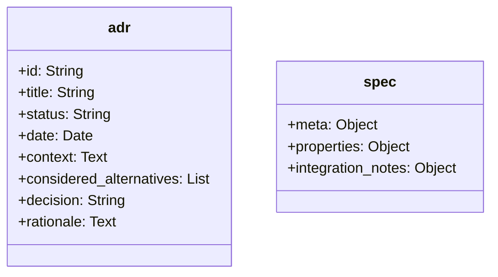
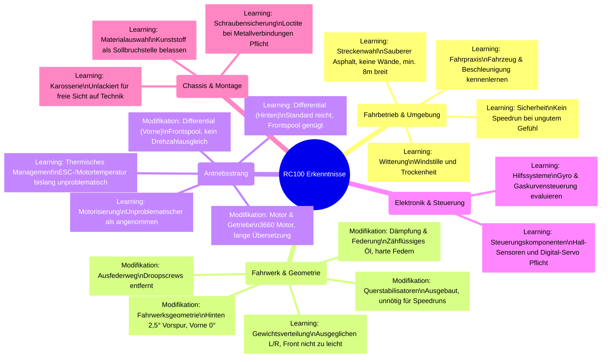

# RC100: 1:10 RC-Fahrzeug für Geschwindigkeiten über 100 km/h

Dieses Projekt umfasst die Systemarchitektur und den Aufbau eines Onroad-Tourenwagens im Maßstab 1:10 mit dem Konstruktionsziel einer jederzeit wiederholbaren Endgeschwindigkeit von über 100 km/h. Der Fokus liegt auf der Maximierung der Antriebsleistung bei gleichzeitiger Gewährleistung der Zuverlässigkeit und Kosteneffizienz.

Die technische Herausforderung resultiert primär aus dem gewählten Maßstab und dem limitierten Reifendurchmesser von 64 Millimetern. Während Fahrzeuge ab dem Maßstab 1:8 durch höhere Masseträgheit, größere Abrollumfänge und einen längeren Radstand physikalische Vorteile aufweisen, erfordert der Maßstab 1:10 signifikant höhere Rotordrehzahlen. Dies führt zu hohen mechanischen Belastungen im Antriebsstrang. Das geringe Fahrzeuggewicht erfordert zudem präzise aerodynamische und fahrwerksseitige Abstimmungen zur Sicherstellung der Fahrstabilität bei hohen Geschwindigkeiten.

<table>
  <tr>
    <td></td>
    <td></td>
  </tr>
</table>

## Inhaltsverzeichnis
* [Repository-Struktur](#repository-struktur)
* [Hardwarearchitektur und Mechanik](#hardwarearchitektur-und-mechanik)
* [Berechnungsmodelle zur Antriebsauslegung](#berechnungsmodelle-zur-antriebsauslegung)
* [Learnings & Modifikationen](#learnings--modifikationen)
* [Repository-Verwaltung und Automatisierung](#repository-verwaltung-und-automatisierung)
* [Weiterführendes Projekt: Telemetriesystem](#weiterführendes-projekt-telemetriesystem)
* [Lizenzierung](#lizenzierung)

## Repository-Struktur
Das Projekt ist in themenspezifische Verzeichnisse gegliedert:
* **`/architektur`**: Dokumentation grundlegender Systemdesigns und Architekturentscheidungen.
* **`/elektronik`**: Auswahl und Spezifikation elektronischer Komponenten wie Motoren, Fahrtenregler und Akkumulatoren.
* **`/fotos`**: Zentrales Verzeichnis für sämtliche Bilddateien und visuelle Dokumentationen des Projekts.
* **`/mechanik`**: Chassis-Design, Konstruktionsdaten sowie die Spezifikation physischer Bauteile.
  * **`/carten_t410r`**: Fahrzeugspezifische Daten und Anleitungen.
  * **`/geometrie`**: Fahrwerkseinstellungen.
  * **`/karosserie`**: Spezifikationen zur Karosserie.
  * **`/lackierung`**: Farb- und Lackierdaten.
  * **`/raeder`**: Reifenspezifikationen.
* **`/erprobung`**: Erfassung und Auswertung von Testergebnissen und Leistungsmessdaten.
  * **`/tests`**: Protokolle und Daten der Testfahrten.
* **`/projekt`**: Allgemeines Projektmanagement und Übersichten zur Kostenkontrolle.
* **`/reddit`**: Feedback und Diskussionen aus der Community.
* **`/scripts`**: Automatisierungsskripte und Berechnungsmodelle zur Systemauslegung.

## Hardwarearchitektur und Mechanik
Das Projekt unterteilt sich in die oben genannten Schwerpunkte. Die Dokumentation der Architekturentscheidungen (ADRs) sowie die Spezifikationen aller mechanischen und elektronischen Komponenten werden konsequent als strukturierte YAML-Dateien (`.yml` oder `.yaml`) gepflegt. Die formale hierarchische Struktur dieser Dateien ist wie folgt standardisiert:

## Berechnungsmodelle zur Antriebsauslegung
Zur Vermeidung thermischer oder mechanischer Überlastungen der Elektronikkomponenten kommen eigens entwickelte Berechnungsmodelle zum Einsatz:
* **Getriebe-Rechner (`scripts/calc/getriebe_calc.py`)**: Simuliert auf Basis des Reifendurchmessers und der Zielgeschwindigkeit die mechanische Radlast für den Motor in Abhängigkeit der verfügbaren Motorritzel. Die Setups werden in Belastungszonen für das definierte Antriebssystem kategorisiert.
* **Limit-Rechner (`scripts/calc/max_speed.py`)**: Kalkuliert die erreichbare Endgeschwindigkeit unter Einbezug der spezifischen Motordaten, der Akkuspannung und definierter thermischer Toleranzgrenzen anhand der physischen Hardware-Spezifikationen.

## Learnings & Modifikationen (so far...)
Dieser Abschnitt dokumentiert die Erkenntnisse aus den bisherigen Tests & Speedruns im Maßstab 1:10 sowie die daraus resultierenden Modifikationen am Fahrzeug.

## Repository-Verwaltung und Automatisierung
Die Pflege der als YAML-Dateien formatierten Spezifikationen und Architekturentscheidungen löst automatisierte Prozesse aus:
* **Aggregation der Spezifikationen**: Individuelle Hardwarespezifikationen werden zu einer zentralen Spezifikationsdatei im Hauptverzeichnis zusammengeführt.
* **Kostenübersicht**: Stück- und Einkaufslisten werden automatisch aus den Spezifikationen abgeleitet und aktualisiert.
* **Entscheidungsprotokoll**: Architekturentscheidungen werden automatisch in ein chronologisches Protokoll kompiliert.

## Weiterführendes Projekt: Telemetriesystem
An dieses Vorhaben knüpft ein eigenständiges Projekt an, welches sich mit der Entwicklung eines Telemetriedatensystems auf Basis eines ESP32-Mikrocontrollers befasst. Ziel ist die sensorische Erfassung und Übertragung fahrdynamischer Parameter des RC-Fahrzeugs.

## Lizenzierung
* Der Quellcode der Berechnungsmodelle unterliegt der MIT-Lizenz. 
* Das Hardware-Design, die Dokumentationen, Spezifikationen und Testergebnisse sind unter der Creative Commons Attribution 4.0 International Lizenz freigegeben. Eigene Anpassungen und kommerzielle Nutzungen sind unter Nennung der Urheberschaft zulässig.
