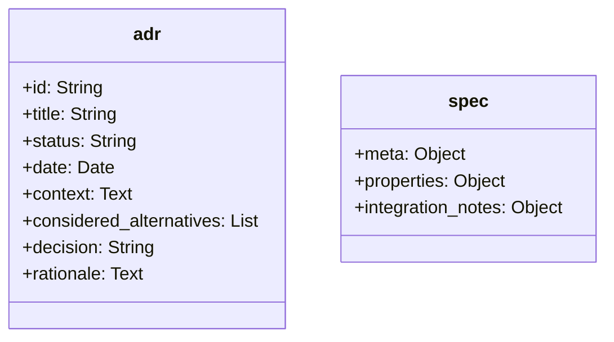

# RC100: 1:10 RC-Fahrzeug für Geschwindigkeiten über 100 km/h

Dieses Projekt umfasst die Entwicklung und den Aufbau eines Onroad-Tourenwagens im Maßstab 1:10 mit dem Konstruktionsziel einer Endgeschwindigkeit von über 100 km/h. Der Fokus liegt auf der Maximierung der Antriebsleistung bei gleichzeitiger Gewährleistung der mechanischen Zuverlässigkeit und Kosteneffizienz.

Die technische Herausforderung resultiert primär aus dem gewählten Maßstab und dem limitierten Reifendurchmesser von 64 Millimetern. Während Fahrzeuge ab dem Maßstab 1:8 durch höhere Masseträgheit und größere Abrollumfänge physikalische Vorteile aufweisen, erfordert der Maßstab 1:10 signifikant höhere Rotordrehzahlen. Dies führt zu hohen mechanischen Belastungen im Antriebsstrang. Das geringe Fahrzeuggewicht erfordert zudem präzise aerodynamische und fahrwerksseitige Abstimmungen zur Sicherstellung der Fahrstabilität bei hohen Geschwindigkeiten.

<table>
  <tr>
    <td></td>
    <td></td>
  </tr>
</table>

## Inhaltsverzeichnis
* [Repository-Struktur](#repository-struktur)
* [Hardwarearchitektur und Mechanik](#hardwarearchitektur-und-mechanik)
* [Berechnungsmodelle zur Antriebsauslegung](#berechnungsmodelle-zur-antriebsauslegung)
* [Learnings & Modifikationen](#learnings--modifikationen)
* [Repository-Verwaltung und Automatisierung](#repository-verwaltung-und-automatisierung)
* [Weiterführendes Projekt: Telemetriesystem](#weiterführendes-projekt-telemetriesystem)
* [Lizenzierung](#lizenzierung)

## Repository-Struktur
Das Projekt ist in themenspezifische Verzeichnisse gegliedert:
* **`/architektur`**: Dokumentation grundlegender Systemdesigns und Architekturentscheidungen.
* **`/elektronik`**: Auswahl und Spezifikation elektronischer Komponenten wie Motoren, Fahrtenregler und Akkumulatoren.
* **`/mechanik`**: Chassis-Design, Konstruktionsdaten sowie die Spezifikation physischer Bauteile.
* **`/messdaten`**: Erfassung und Auswertung von Testergebnissen und Leistungsmessdaten.
* **`/projekt`**: Allgemeines Projektmanagement und Übersichten zur Kostenkontrolle.
* **`/scripts`**: Automatisierungsskripte und Berechnungsmodelle zur Systemauslegung.

## Hardwarearchitektur und Mechanik
Das Projekt unterteilt sich in die oben genannten Schwerpunkte. Die Dokumentation der Architekturentscheidungen (ADRs) sowie die Spezifikationen aller mechanischen und elektronischen Komponenten werden konsequent als strukturierte YAML-Dateien (`.yml` oder `.yaml`) gepflegt. Die formale hierarchische Struktur dieser Dateien ist wie folgt standardisiert:

## Berechnungsmodelle zur Antriebsauslegung
Zur Vermeidung thermischer oder mechanischer Überlastungen der Elektronikkomponenten kommen eigens entwickelte Berechnungsmodelle zum Einsatz:
* **Getriebe-Rechner (`scripts/calc/getriebe_calc.py`)**: Simuliert auf Basis des Reifendurchmessers und der Zielgeschwindigkeit die mechanische Radlast für den Motor in Abhängigkeit der verfügbaren Motorritzel. Die Setups werden in Belastungszonen für das definierte Antriebssystem kategorisiert.
* **Limit-Rechner (`scripts/calc/max_speed.py`)**: Kalkuliert die erreichbare Endgeschwindigkeit unter Einbezug der spezifischen Motordaten, der Akkuspannung und definierter thermischer Toleranzgrenzen anhand der physischen Hardware-Spezifikationen.

## Learnings & Modifikationen
Dieser Abschnitt dokumentiert die Erkenntnisse aus den bisherigen Geschwindigkeitsfahrten im Maßstab 1:10 sowie die daraus resultierenden Modifikationen am Fahrzeug.

| Nr. | Typ | Bereich | Thema | Beschreibung |
|---|---|---|---|---|
| 1 | Learning | Fahrbetrieb & Umgebung | Streckenwahl | Die Fahrstrecke erfordert sauberen Asphalt ohne seitliche Begrenzungen durch Wände oder Bordsteine. Die Mindestbreite der Strecke beträgt 8 Meter. |
| 2 | Learning | Fahrbetrieb & Umgebung | Witterung | Fahrten sind ausschließlich bei Trockenheit und Windstille durchzuführen. |
| 3 | Learning | Fahrbetrieb & Umgebung | Sicherheit | Bei ungeeigneten Umgebungsbedingungen ist auf Geschwindigkeitsfahrten zu verzichten. |
| 4 | Learning | Fahrbetrieb & Umgebung | Fahrpraxis | Der Bediener hat sich mit der Beschleunigungscharakteristik des Fahrzeugs vertraut zu machen. Eine präzise Steuerung, insbesondere bei großer Distanz zum Bediener, ist erforderlich. |
| 5 | Modifikation | Fahrwerk & Geometrie | Dämpfung & Federung | Zur Vermeidung von Kontrollverlusten durch fahrzeugseitiges Eintauchen ist eine harte Fahrwerksabstimmung zwingend erforderlich. Es kommt hochviskoses Dämpferöl in Kombination mit maximaler Vorspannung harter Federn zum Einsatz. |
| 6 | Modifikation | Fahrwerk & Geometrie | Fahrwerksgeometrie | Die Fahrwerksgeometrie ist auf Basiswerte eingestellt: Hinterachse 2,5 Grad Vorspur und 0 Grad Sturz; Vorderachse 0 Grad Vorspur und 0 Grad Sturz. Von abweichenden Parametrisierungen ist abzusehen. |
| 7 | Modifikation | Fahrwerk & Geometrie | Querstabilisatoren | Die Querstabilisatoren wurden demontiert. Diese Komponenten sind für Geschwindigkeitsfahrten im Geradeauslauf technisch nicht erforderlich und stellen eine redundante Fehlerquelle dar. |
| 8 | Modifikation | Fahrwerk & Geometrie | Ausfederweg | Die Schrauben zur Begrenzung des Ausfederwegs (Droop-Screws) wurden demontiert. Eine weitere Tieferlegung des Fahrzeugs ist aufgrund von potenziellen Verschmutzungen auf der Fahrstrecke nicht praktikabel. |
| 9 | Learning | Fahrwerk & Geometrie | Gewichtsverteilung | Eine ausbalancierte Gewichtsverteilung auf der Querachse ist zwingend erforderlich. Einer zu geringen Achslast an der Vorderachse ist konstruktiv entgegenzuwirken, um die Fahrstabilität zu gewährleisten. |
| 10 | Learning | Antriebsstrang | Motorisierung | Die Motorleistung ist ein sekundärer Faktor für die Zielerreichung. Ein übermäßiger Ressourceneinsatz in diesem Bereich ist nicht zielführend. |
| 11 | Modifikation | Antriebsstrang | Motor & Getriebe | Es wird ein Motor der Baugröße 3660 (anstelle von 3650) in Verbindung mit einer langen Getriebeübersetzung verwendet. Die Antriebskonfiguration ist auf die Dimensionen der verfügbaren Fahrstrecke abzustimmen. |
| 12 | Modifikation | Antriebsstrang | Differential (Vorderachse) | Die Vorderachse ist mit einem Frontspool (Starrachse) ausgestattet. Dies verhindert unerwünschten Drehzahlausgleich und stabilisiert den Geradeauslauf bei Höchstgeschwindigkeit. |
| 13 | Learning | Antriebsstrang | Differential (Hinterachse) | Eine Erhöhung des Sperrgrades am hinteren Differential ist nicht erforderlich. Die Modifikation der Vorderachse (Frontspool) ist zur Fahrstabilisierung ausreichend. |
| 14 | Learning | Antriebsstrang | Thermisches Management | Kritische Temperaturentwicklungen am Fahrtenregler (ESC) oder Motor wurden im Testbetrieb bisher nicht verzeichnet. Die thermische Belastung ist für das gewählte Setup unkritisch. |
| 15 | Learning | Elektronik & Steuerung | Steuerungskomponenten | Präzise Steuerungskomponenten sind zwingend erforderlich. Der Einsatz einer Fernsteuerung mit Hall-Sensoren in Kombination mit einem hochwertigen Digitalservo (z. B. Savöx) ist obligatorisch. Einfache Potentiometer-Systeme bieten nicht die geforderte Präzision für Lenkkorrekturen bei Maximalgeschwindigkeit. |
| 16 | Learning | Elektronik & Steuerung | Hilfssysteme | Der Einsatz elektronischer Hilfsmittel zur Fahrstabilisierung (Gyroskop-Systeme, Gaskurvensteuerung) ist bei der Systemkonzeption zu evaluieren. |
| 17 | Learning | Chassis & Montage | Materialauswahl | Ein vollumfänglicher Austausch von Kunststoffkomponenten durch Aluminiumteile ist abzulehnen. Die Materialauswahl hat unter Berücksichtigung definierter Sollbruchstellen zu erfolgen, um die Ableitung von Aufprallenergie bei Unfällen kontrolliert zu steuern. |
| 18 | Learning | Chassis & Montage | Schraubensicherung | Die Applikation von flüssiger Schraubensicherung bei sämtlichen Metall-auf-Metall-Verbindungen ist obligatorisch. |
| 19 | Learning | Chassis & Montage | Karosserie | Auf eine Lackierung der Karosserie ist zu verzichten. Die transparente Ausführung ermöglicht die permanente Sichtprüfung der internen Technik. |

## Repository-Verwaltung und Automatisierung
Die Pflege der als YAML-Dateien formatierten Spezifikationen und Architekturentscheidungen löst automatisierte Prozesse aus:
* **Aggregation der Spezifikationen**: Individuelle Hardwarespezifikationen werden zu einer zentralen Spezifikationsdatei im Hauptverzeichnis zusammengeführt.
* **Kostenübersicht**: Stück- und Einkaufslisten werden automatisch aus den Spezifikationen abgeleitet und aktualisiert.
* **Entscheidungsprotokoll**: Architekturentscheidungen werden automatisch in ein chronologisches Protokoll kompiliert.

## Weiterführendes Projekt: Telemetriesystem
An dieses Vorhaben knüpft ein eigenständiges Projekt an, welches sich mit der Entwicklung eines Telemetriedatensystems auf Basis eines ESP32-Mikrocontrollers befasst. Ziel ist die sensorische Erfassung und Übertragung fahrdynamischer Parameter des RC-Fahrzeugs.

## Lizenzierung
* Der Quellcode der Berechnungsmodelle unterliegt der MIT-Lizenz. 
* Das Hardware-Design, die Dokumentationen, Spezifikationen und Testergebnisse sind unter der Creative Commons Attribution 4.0 International Lizenz freigegeben. Eigene Anpassungen und kommerzielle Nutzungen sind unter Nennung der Urheberschaft zulässig.
